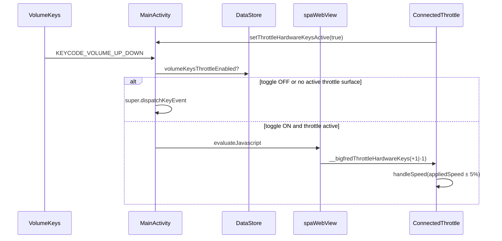

# Volume Keys Throttle Control — Implementation Plan

## Overview

Intercept Android volume keys in the BigFred native WebView shell and forward them to the SPA as throttle speed steps (5% of `maxSpeed` per press, with system key-repeat on hold). The same code path as gamepad input (`handleSpeed` → debounced WebSocket).

Two pull requests:

1. **bigfred/web** — SPA handler (`window.__bigfredThrottleHardwareKeys`)
2. **bigfred-android-client** — native interception, settings toggle, JS injection

---

## UX Decisions

| Decision | Choice |
|----------|--------|
| Volume Up / Down | Faster / slower |
| One press | 5% of `maxSpeed` (`Math.max(1, Math.round(maxSpeed * 0.05))`) |
| Hold | Android system key-repeat (`ACTION_DOWN` with `repeatCount`) |
| Settings toggle | **On by default** — “Use volume buttons to control vehicle speed” |
| Toggle **on** | Volume keys consumed **only while a Throttle surface is active** (SPA registers via `setThrottleHardwareKeysActive`); elsewhere system volume works normally |
| Toggle **off** | Normal system volume everywhere |

---

## Architecture



Volume keys do **not** reach the WebView as DOM `keydown` events. They are caught in `Activity.dispatchKeyEvent` and injected via `evaluateJavascript` (same pattern as `__bigfredSetLocale` / `__bigfredOnModelPicked`).

The SPA tells the shell when a throttle surface mounts/unmounts via `BigFredNativeApp.setThrottleHardwareKeysActive(boolean)`, so volume keys keep normal system behaviour outside Throttle / takeover.

### Web stack

| Module | Role |
|--------|------|
| `volumeKeyStepSize.ts` | Step size (5% max, min 1) |
| `applyThrottleHardwareKeyStep` | Clamp speed after direction |
| `throttleHardwareKeysRegistry.ts` | Handler stack (takeover over main throttle) |
| `useThrottleHardwareKeys.ts` | React hook; registers on mount |
| `ConnectedThrottle` / `TakeoverThrottleOverlay` | Wire to `handleSpeed` |

### Android stack

| Module | Role |
|--------|------|
| `ServerPreferences` | `volume_keys_throttle_enabled` (default `true`) |
| `SettingsScreen` | Switch (PL / EN / DE) |
| `MainActivity.volumeKeyInterceptor` | `dispatchKeyEvent` consume |
| `BigFredApp` | `DisposableEffect` when WebView + toggle on |
| `VolumeKeyThrottle.kt` | Pure `handleVolumeKey` + `throttleHardwareKeysJavascript` |
| `deliverThrottleHardwareKeys` | `evaluateJavascript` on UI thread |

### Speed path (unchanged lever drag model)

```
__bigfredThrottleHardwareKeys
  → handleSpeed / queueSpeed
  → noteUserSpeed (optimistic lever, 2s)
  → useDebouncedSpeedSend (~100ms)
  → DccBusContext.setSpeed → WS loco.setSpeed
```

---

## Design Decisions and Rationale

| Decision | Rationale |
|----------|-----------|
| Global callback vs `postMessage` | Consistent with existing native→web bridge; one direction only |
| Handler stack | Takeover modal over Throttle; pop restores main handler without re-mount |
| 5% `maxSpeed`, not gamepad step | Explicit UX requirement; independent of gamepad mapping |
| Same path as `handleSpeed` | Debounce, train/loco, optimistic override — no DCC duplication |
| `disabled` only when no drive target | Volume works even with gamepad mapping dialog open |
| Interceptor in `Activity`, not `WebView` | Volume keys go to the focused window, not Chromium keyboard |
| Consume only while SPA reports throttle active | `setThrottleHardwareKeysActive` — system volume works outside Throttle |
| Consume `ACTION_UP` too | Prevents system volume change on key release while claimed |
| Toggle in native Settings only | Single configuration surface; SPA stays unaware |
| Default on | Primary use case: phone as throttle pilot |
| Pure functions + JUnit | Existing test setup; no Robolectric/Espresso cost |

---

## Test Coverage

### Web (`npm test`)

| File | Coverage |
|------|----------|
| `volumeKeyStepSize.test.ts` | 5% step, minimum 1 |
| `useThrottleHardwareKeys.test.ts` | `applyThrottleHardwareKeyStep` clamp / direction |
| `throttleHardwareKeysRegistry.test.ts` | Stack push/pop, top handler priority |

### Android (`./gradlew test`)

| File | Coverage |
|------|----------|
| `VolumeKeyThrottleTest.kt` | `handleVolumeKey` UP/DOWN, UP without step, other keys |
| `ThrottleHardwareKeysScriptTest.kt` | JS snippet contains handler name and direction |
| `ServerPreferencesTest.kt` | `DEFAULT_VOLUME_KEYS_THROTTLE_ENABLED == true` |

---

## Manual Test Checklist

- [ ] Toggle **on**: Throttle screen — volume changes speed, no system volume UI
- [ ] Toggle **on**: Non-throttle route — no loco effect
- [ ] Toggle **off**: System volume works
- [ ] Hold volume key — repeated 5% steps
- [ ] Takeover overlay — volume controls taken-over vehicle; after close, main throttle works again
- [ ] Settings toggle persists across app restart

---

## Out of Scope

- Direction / Stop on volume long-press
- Toggle in SPA
- Espresso / WebView E2E tests
